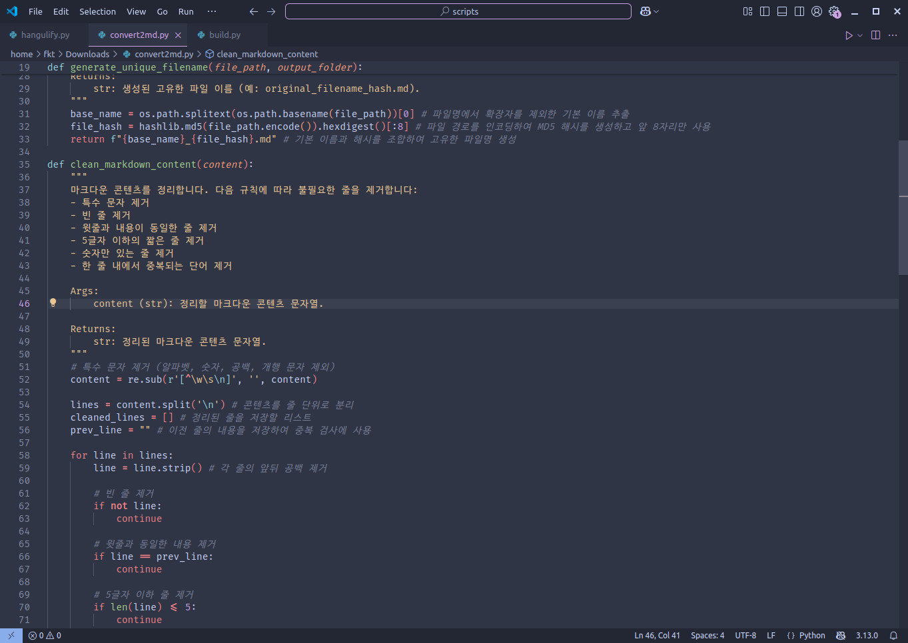

# FiraD2 - FiraCode with Hangul



FiraCode와 D2Coding의 장점을 결합했습니다. JetBrains Mono에 D2Coding의 한글 영역(U+3131-U+318E, U+AC00-U+D7A3)을 덧씌운 뒤 최적의 가독성을 위해 글자 폭을 조정했습니다. 또한 vim을 위한 Nerd Fonts도 포함되어 있습니다.

-----

## 폰트 다운로드

[release](https://github.com/partrita/FiraD2/releases) 페이지에서 `ttf` 파일들을 직접 다운로드할 수 있습니다. 파일명에 포함된 용어에 대한 설명은 아래를 참고하세요.

  * `FiraD2-Regular.ttf`: 일반 글꼴입니다. 주로 이 파일을 사용하시면 됩니다.
  * `FiraD2-Regular.woff2`: 웹폰트 용도에 적합합니다.
  * `FiraD2NF-Regular.ttf`: NF는 Nerd Font의 약자로, 일반 폰트와 다양한 아이콘 글리프를 포함합니다.
  * `FiraD2NFM-Regular.ttf`: NFM은 Nerd Font Mono의 약자로, 고정폭 폰트를 의미합니다.
  * `FiraD2NFP-Regular.ttf`: NFP는 Nerd Font Proportional의 약자로, 비등폭 글꼴을 의미합니다. 일반적인 텍스트, GUI, 프레젠테이션 등 문자의 폭이 다른 경우에 적합합니다.
  * `FiraD2NL-Regular.ttf`: NL은 No Ligatures를 의미합니다. 개발자를 위해 디자인된 합자(ligature) 기능이 제거된 버전입니다.


## 직접 빌드하기

Docker를 사용하여 직접 빌드하는 방법은 아래와 같습니다.

1.  먼저 저장소를 복제하고 Docker 이미지를 빌드합니다(이미지 이름을 `JBD2`로 지정):

    ```bash
    gh repo clone partrita/FiraD2
    cd FiraD2
    docker build -t firad2 .
    ```

2.  빌드된 Docker 이미지를 인터랙티브 모드로 실행합니다:

    ```bash
    docker run -it -v "$(pwd)":/app firad2
    ```

3.  Docker 컨테이너 안에서 다음 명령어를 실행할 수 있습니다:

      * `python3 scripts/build.py all`: 자동으로 설정하고 폰트를 빌드합니다.
      * `python3 scripts/build.py setup`: 필요한 폰트 파일을 다운로드하고 압축을 해제합니다.
      * `python3 scripts/build.py build`: 폰트를 병합하고 최종 결과물을 출력합니다.
      * `python3 scripts/build.py clean`: 다운로드된 파일과 출력 파일을 모두 삭제합니다.


## Config 설명

`config.py` 파일에는 폰트 빌드 프로세스를 제어하는 여러 변수가 정의되어 있습니다.

## 라이선스

이 프로젝트는 OFL(Open Font License) 하에 배포됩니다. 자세한 내용은 `LICENSE` 파일을 참조해주세요.
